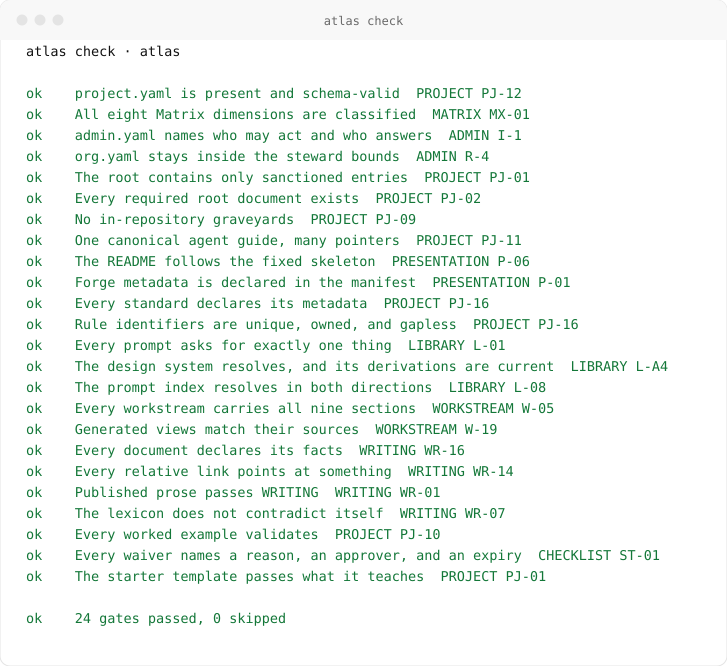
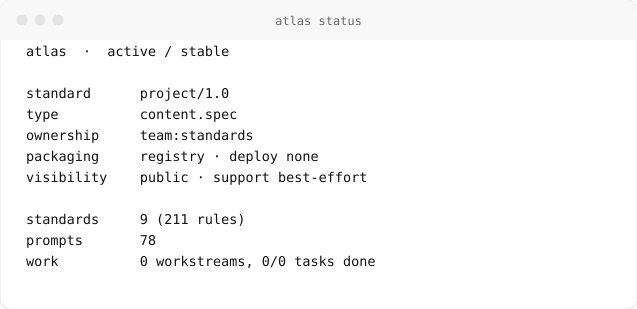
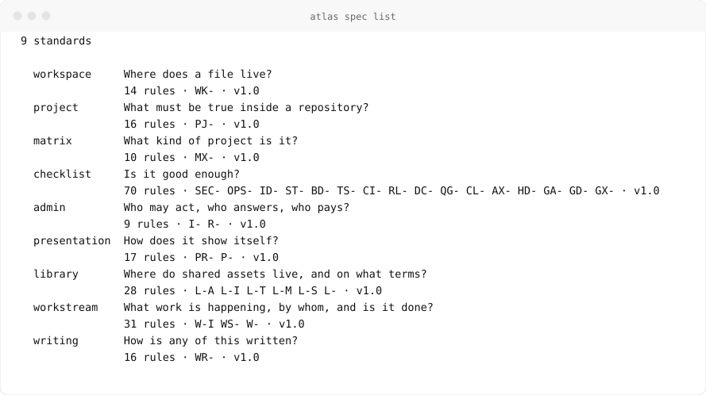

<picture>
  <source media="(prefers-color-scheme: dark)" srcset="assets/demo-check-dark.svg">
  
</picture>

# Atlas

**Declared, versioned, machine-checked structure for digital work.**

Nine standards say what must be true of a body of work — where its files live,
what a repository contains, what kind of project it is, when it is good enough,
who may act, how it shows itself, where shared assets go, how work is tracked,
and how all of it is written. One command checks a repository against every one
of them.

[](project.yaml)
[](docs/reference/quick-reference.md)
[](CHANGELOG.md)
[](docs/reference/versioning.md)
[](.github/workflows/ci.yml)
[](LICENSE)

```bash
pip install atlas-standard
atlas check
```

## What & Why

Two people look at the same repository and disagree about whether it is ready to
ship. One points at the passing tests. The other points at the missing runbook
and the owner who left in March. Both are looking at real evidence, and neither
can settle it, because nobody wrote down what *ready* means here.

Atlas writes it down. The argument then moves: instead of trading opinions, two
people read 24 gates and a list of what failed — and every failure cites the
rule behind it, so it can be fixed, waived with a date, or argued with.

That works whether or not you write code, which is the point. Most of the people
affected by how an organization structures its work are not the people who build
its tools.

## Quickstart

Start a repository that already passes:

```bash
atlas init invoice-api ../invoice-api --owner team:payments
cd ../invoice-api
atlas check
```

Ask where an existing one stands:

<picture>
  <source media="(prefers-color-scheme: dark)" srcset="assets/demo-status-dark.svg">
  
</picture>

Read a rule, find a written-once prompt, open a piece of work:

```bash
atlas spec show project --rules
atlas prompt show cut-release | pbcopy
atlas work new migrate-the-fleet --owner person:you
```

## The nine standards

<picture>
  <source media="(prefers-color-scheme: dark)" srcset="assets/demo-spec-dark.svg">
  
</picture>

| # | Standard | Answers | Spec |
|---|---|---|---|
| 1 | **WORKSPACE** | Where does a file live? | [`spec/workspace.md`](spec/workspace.md) |
| 2 | **PROJECT** | What must be true inside a repository? | [`spec/project.md`](spec/project.md) |
| 3 | **MATRIX** | What kind of project is it? | [`spec/matrix.md`](spec/matrix.md) |
| 4 | **CHECKLIST** | Is it good enough? | [`spec/checklist.md`](spec/checklist.md) |
| 5 | **ADMIN** | Who may act, who answers, who pays? | [`spec/admin.md`](spec/admin.md) |
| 6 | **PRESENTATION** | How does it show itself? | [`spec/presentation.md`](spec/presentation.md) |
| 7 | **LIBRARY** | Where do shared assets live, and on what terms? | [`spec/library.md`](spec/library.md) |
| 8 | **WORKSTREAM** | What work is happening, by whom, and is it done? | [`spec/workstream.md`](spec/workstream.md) |
| 9 | **WRITING** | How is any of this written? | [`spec/writing.md`](spec/writing.md) |

211 rules and checklist items, each with a permanent identifier, so a review
comment can cite `PJ-01` and the reader knows exactly which paragraph to open.

## Two kinds of checking

`atlas check` asks whether the **repository** is in order: 24 gates over
manifests, structure, documents, the library, work, and prose. `atlas lint`
asks whether a **document** is: 11 rules from WRITING.

```bash
atlas check --only root-closed-set     # one gate at a time
atlas lint --changed --strict          # what this branch touched
atlas check --json | jq '.checks[]'    # output a script can read
```

Errors fail the run. Warnings are judgement calls — a 40-word sentence may be
the right sentence. Everything a machine cannot fairly decide is left to a
reviewer, deliberately.

## Honest exceptions

Every standard eventually meets a case it cannot accommodate. Atlas has one
mechanism for that, and it is not a quiet exclusion list:

```yaml
waivers:
  - item: ST-03
    reason: "Secret scanning blocked on the vendor migration; tracked in work/03."
    approver: team:platform
    expires: 2026-11-30
```

A waiver names the item, the reason, the approver, and an expiry. The gate
honours it until the date, and then fails. Exceptions are visible, attributable,
and self-removing rather than permanent by inattention.

## The CLI

One command operates every part of a repository. Typing `atlas` with no
arguments prints a help tree grouped by what you are trying to do. Every command
accepts `--json`, and the exit codes tell a script the difference between "this
has violations" and "you typed the flag wrong".

| Command | Does |
|---|---|
| `atlas init` | Start a new repository that already passes |
| `atlas status` | Show what this project is and where it stands |
| `atlas doctor` | Find out why something is not working |
| `atlas check` | Check this repository against the standard |
| `atlas lint` | Check a document against WRITING |
| `atlas validate` | Check that a manifest is filled in correctly |
| `atlas spec` | Read the standards and cite their rules |
| `atlas prompt` | Find a written-once request to paste or hand over |
| `atlas library` | Inspect the shared prompts, lexicon, and assets |
| `atlas work` | Plan, track, and verify initiatives |
| `atlas site` | Render the standards and docs as a website |
| `atlas completion` | Print a shell completion script |

Full reference: [`docs/reference/cli.md`](docs/reference/cli.md), generated from
the argument parser, so it cannot describe a flag the tool lacks.

## Prompt library

[`library/prompts/`](library/prompts/README.md) holds 78 written-once requests
across 14 categories of a project's life: workspace, repository, architecture,
documentation, `github`, administration, quality, security, releases, maintenance,
design, agents, operations, and workstreams. Each asks for one thing in three
sentences at most, and anything destructive carries its guardrail in the
sentence, so a prompt pasted carelessly still fails safe.

```bash
atlas prompt search release
atlas prompt show cut-release
```

## Design system

[`library/design/DESIGN.md`](library/design/README.md) is **Neue**, the fleet's
visual identity: normative OKLCH tokens as front matter, application prose after
them. It is consumed, never forked (`P-11`) — in this repository the badges, the
terminal demos above, and `atlas site build` all derive their values from it
through one generator, and the `design-current` gate fails when a derivation
goes stale. Re-theming the fleet is an edit to one file. The built CSS, layouts,
templates, and fonts teams apply day to day ship as the
[`neue-design`](library/skills/neue-design/SKILL.md) skill in
[`library/skills/`](library/skills/README.md).

## Work management

[`work/`](work/) holds every initiative, one numbered directory each, all with
the same nine sections: plan, tasks, requirements, decisions, research,
deliverables, validation, agents, issues. A person joining on Tuesday and an
agent picking the work up on Wednesday both find the plan in `01_plan/`.

The task table is the original. [`work/README.md`](work/README.md), the
dashboard a person reads, and `work/index.yaml`, the file an agent reads, are
generated from it. Progress is counted, never claimed.

## Repository layout

```text
spec/          the product: nine standards + JSON Schemas
src/atlas/     the tooling: core library, then a CLI on top of it
library/       shared assets: 78 prompts, the design system, the skills, the lexicon
work/          every initiative as a numbered workstream + generated dashboard
template/      starter repository that passes every gate on its first run
examples/      worked manifests, validated in CI
docs/          guides, reference, architecture, decisions
tests/         self-hosting, schema, parser, linter, CLI, and template checks
scripts/       thin wrappers and generators for a bare checkout
assets/        badges and terminal demos, generated from real output
```

## Documentation

**Start here**

- [`docs/guides/install.md`](docs/guides/install.md): install the CLI and run it
- [`docs/reference/glossary.md`](docs/reference/glossary.md): every term, in plain language
- [`docs/reference/quick-reference.md`](docs/reference/quick-reference.md): the suite on one page
- [`docs/reference/conventions.md`](docs/reference/conventions.md): how to name and place anything

**Doing something**

- [`docs/guides/new-project.md`](docs/guides/new-project.md): start a project
- [`docs/guides/adoption.md`](docs/guides/adoption.md): adopt this where repositories already exist
- [`docs/guides/work-management.md`](docs/guides/work-management.md): running the work system
- [`docs/reference/cli.md`](docs/reference/cli.md): every command and flag

**Understanding it**

- [`docs/architecture/repository-design.md`](docs/architecture/repository-design.md): how the pieces fit and why
- [`docs/architecture/cli-design.md`](docs/architecture/cli-design.md): why the CLI is shaped this way
- [`docs/decisions/`](docs/decisions/0001-gates-as-a-registry.md): the decision records
- [`docs/reference/rule-ids.md`](docs/reference/rule-ids.md): how to cite a rule
- [`docs/reference/versioning.md`](docs/reference/versioning.md): release version against standard version

## Status

`stage: active` · `maturity: stable` · `support: best-effort`. Those values, and
the badges above, are drawn from [`project.yaml`](project.yaml) by
`python scripts/build_assets.py`, so a badge cannot claim something the manifest
no longer says (`P-07`). The terminal images are recorded by running the
commands, so a screenshot cannot show a result the tool does not produce.

The release version (`v1.0.0`) and the standard's contract version
(`project/1.0`) move independently: the tooling can gain a feature without the
contract changing, and the contract can tighten without a new build. That
independence is exactly why there are two numbers:
[versioning](docs/reference/versioning.md).

> **Important**
> Forking this for your own organization? Replace `OWNER` in `project.yaml`,
> `.github/settings.yml`, and `.github/CODEOWNERS`, replace the principals in
> [`admin.yaml`](admin.yaml), then run `atlas check`.

## Contributing

See [CONTRIBUTING.md](CONTRIBUTING.md). A change to what the standard *requires*
travels with its schema, its version, and its changelog entry in one change-set,
so the contract and its enforcement never disagree.

## License

The standards are [CC BY 4.0](LICENSE); the tooling is MIT. Security policy:
[SECURITY.md](SECURITY.md).
