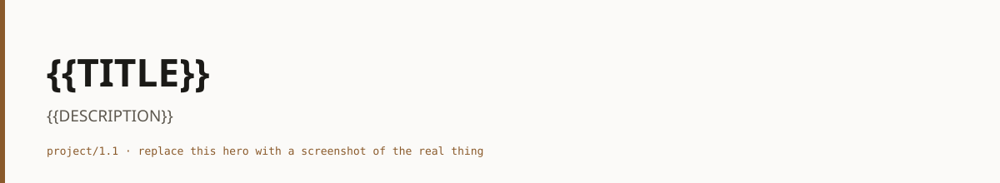
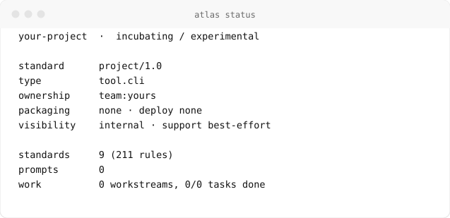

<picture>
  <source media="(prefers-color-scheme: dark)" srcset="docs/assets/hero-dark.svg">
  
</picture>

# {{TITLE}}

**{{DESCRIPTION}}**

[](project.yaml)
[](project.yaml)
[](project.yaml)

## What & Why

Three sentences at most. What this is, who it is for, and the problem it removes.
Replace this paragraph before anyone else reads it.

## Quickstart

```bash
git clone https://example.com/{{NAME}}
cd {{NAME}}
```

The quickstart is true or it is a bug: a stranger on a clean machine reaches
first success by copy-paste alone (PJ-05).

## Documentation

- [`docs/guides/`](docs/guides/getting-started.md): task-oriented how-tos
- [`docs/reference/`](docs/reference/) — lookups and generated reference
- [`docs/decisions/`](docs/decisions/0001-adopt-atlas.md): why things are the way they are

## Status

<picture>
  <source media="(prefers-color-scheme: dark)" srcset="docs/assets/demo-status-dark.svg">
  
</picture>

`stage: incubating` · `maturity: experimental` · `support: best-effort`. These
values, and the badges above, are drawn from [`project.yaml`](project.yaml),
which is where they are defined. Run `atlas status` for the rest.

## Contributing

See [CONTRIBUTING.md](CONTRIBUTING.md). Change flows through review once this
repository is past `incubating` (PJ-15).

## License

See [LICENSE](LICENSE).
